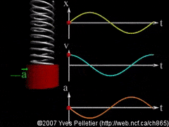
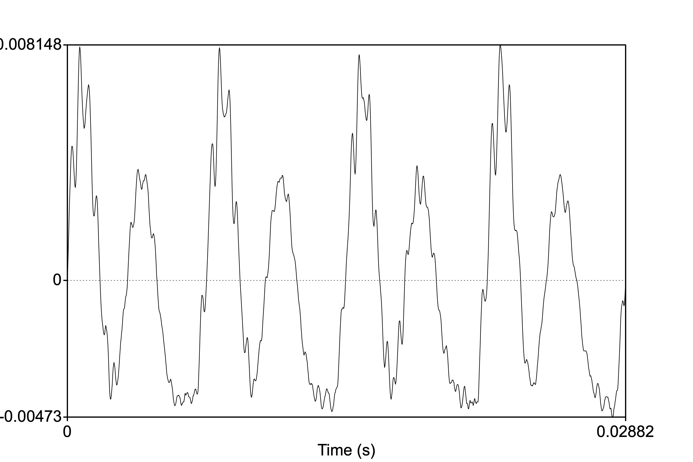
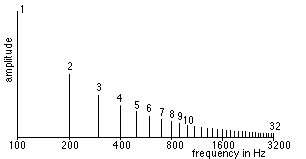
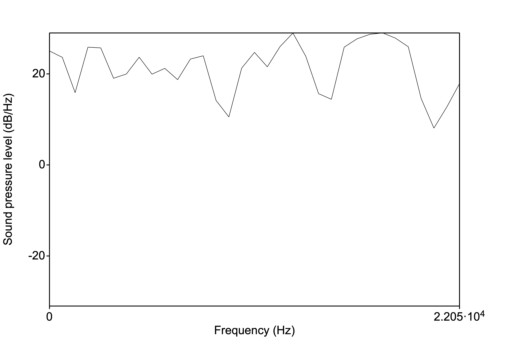
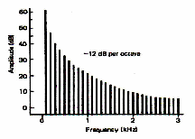

<style type="text/css">
  body{
  font-size: 12pt;
}
</style>

```{r setup, include=FALSE}
knitr::opts_chunk$set(message=FALSE,warning=FALSE, cache=TRUE)
options(repos = list(CRAN="http://cran.rstudio.com/"))
```

# Software installation
This course introduces you to some basics of instrumental phonetic analysis. You will need the following two pieces of software:

* Praat: Acoustic phonetic analysis software. It's free and available [here](http://www.praat.org). Please download it and follow the installation instructions. 
* R Studio: R is a statistical analysis language and R Studio is the user interface which allows you to do a variety of things with data, like modeling and visualizing. We'll just scratch the outermost surface of what R allows you to do. But first you'll need to have the R software (R Studio sits on top of the basic R software!). Go [here](https://cran.rstudio.com/) to first download R onto your machine. Then download R Studio for free [here](https://www.rstudio.com/products/rstudio/download/#download). Here's a nice [video](https://www.youtube.com/watch?v=TFGYlKvQEQ4) that walks you through the process.

# Acoustics basics

Any course in phonetics will assume some basic understanding of how speech is produced and what the nature of the speech signal is like (i.e., what it's made of and how it relates to the vocal apparatus). These notes are meant to give you a brief introduction of the basics of acoustics as it relates to speech sounds. This by no means comprehensive and you should be encouraged to seek out explanations for more difficult questions you might have about the details of speech acoustics. The internet is your friend, but there are plenty of books which can help you along the way. Ask me and I can offer some suggestions. 

***

# The Speech Chain
The speech chain represents the nature of communicating a linguistic message via the vocal-audition apparatus.

<p align="center">
  
</p>


In this course, we will be examining, in detail, the nature of:

* **Acoustics**: the physical properties of sound
* **Production**: the physical process of producing sounds
* **Perception**: the psychological process of speech reception

# Sound

Sound is essentially changes in air pressure that results from some sort of disturbance, like the smacking of a table top or the vibrating of vocal folds. For speech sounds, tiny changes in pressure are a result of air molecules beign set in motion by the movement of the vocal folds. These changes in air pressure between air molecules end up at the listener's ear. This animated gif schematizes the general idea of some movement (the hand moving up) setting in to motion the rope. The change in air pressure is represented by the wave in the rope, which moves and ultimately reaches a target (or the listener's ear).


Molecules of air move in a random pattern, called [Brownian motion](https://en.wikipedia.org/wiki/Brownian_motion) and collide with each other and other objects at a relatively constant pressure.

<p align="center">
  
</p>

# Airflow

Air moves from an area high pressure to an area of low pressure in order to equalize → driving pressure. Air only moves when there is a pressure differential between the areas. If there is no difference in pressure between the two areas, there is no airflow. This is very important for speech, as will become clearer when we discuss place and manner of articulation. 

# Pressure
## Boyle's Law

Another important concept for our understanding of speech processes is that formulated by the English polymath, [Robert Boyle](https://en.wikipedia.org/wiki/Robert_Boyle). Boyle's law characterized the relationship between the pressure of a gas and the volume of its container.

> Boyle's Law says that that pressure and volume are inversely related. The bigger the container, the lower the pressure; the smaller the container, the higher the pressure of the gas within. 

<p align="center">
  
</p>

For our purposes, it's useful to imagine the relationship between two containers, or the same container at different points in time. In the equation below, imagine a fixed mass of gas (ok, air). The relationship between the pressure of that gas and the volume of the container is constant. So increasing the volume would mean a decrease in pressure (so long as the mass of the gas is the same and the temperature doesn't change).

> $$ P_1 V_1~ = P_2 V_2 $$ 

<p align="center">
  
</p>


We know that there are air molecule pressure changes, cumulatively, involved when the volume of the container shrinks or expands, but what exactly happens between individual air molecules?

## Compression/Rarefaction

> When air molecules collide there is a moment of high pressure. This is called **compression**. The idea here is simple and can be roughly analogized to the Boyle's law examples above. Imagine the plunger and bottom wall of the piston are air molecules. As they approach each other (or are compressed), pressure between them increases.

M~1~&rarr;&rarr;&rarr;&rarr;M~1~ M~2~\
As M~1~ approaches M~2~ there is increasing pressure (compression)

<p align="center">
  
</p>

> When the molecule “bounces” back and overshoots its original position, it causes an area of low air density, resulting in low pressure → rarefaction

M~1~ &larr; M~1~ &larr;&larr;&larr; M~2~\
As M~1~ moves away from M~2~ there is decreasing pressure (rarefaction)

Here is a nice [video demonstration](https://www.youtube.com/watch?v=bYoTRx6gGX0) and explanation of compression and rarefaction of air molecules.

# Simple harmonic motion
Simple harmonic motion (SHM) results when the restoring force on an object is proportional to the displacement from equilibrium in the opposite direction. SHM is a special type of periodic motion (we'll discuss periodicity below) that refers to the a back and forth motion that repeats itself at regular intervals.

With SHM, there is acceleration of an object through the "zero point" or equilibrium and deceleration at the endpoints of the movement. In the animation below, the weight's equilibrium point (or the spring's natural length) would be represented by y=0.

<p align="center">
  
</p>

## Frequency
One back and forth movement through the equilibriam point constitutes one *cycle* of vibration.When describing sound, these cycles refer to the movement of air molecules moving back and forth. When the molecule is set into motion (from some disturbance, like the movement of the vocal folds or the slamming of a door), it is propelled, reaches some maximum, travels back through its original starting point (equilibrium) and proceeds again in the direction opposite the one it initially travelled, then back again to equilibrium (one complete cycle). 

This movement results in pressure changes. A cycle when describing sound is:

> One cycle = increase in P from P~atm~ (compression), a decrease in P below to P~atm~ (rarefaction), then increase back to equilibrium
> The number of cycles completed in one second is called the **frequency** and is measured in Hertz (Hz)

For speech, we very often encounter frequencies in the thousands, so instead of writing, say, 5600 Hz, we might change the units to kilohertz (1000 Hz) giving us 5.6kHz.

[Here](https://youtu.be/pANIvSh2r2A) is a strobe video of a tuning fork. The tines (or arms) of the fork vibrate in unison, moving away from equilibrium, reaching a maximum displacement, then back toward the center and beyond, then back again. 

## Period

> The **period** of a waveform is the time it takes for one cycle to occur

Period is inversly proportional to frequency. So:
$$F = 1/t ; t = 1/F$$
If the frequency is 100Hz (or 100 cycles per second), then the period is 1/100 or 0.01 seconds. Period is symbolized as *t*.

Here's a little practice question:
If *t* = 0.003, then what is the frequency?
<!-- Answer options go here -->
<div class="radio">
  <label>
    <input type="radio" name="question01" id="opt1" value="33kHz" onchange="check_answer()">
    33kHz 
  </label>
</div>
<div class="radio">
  <label>
    <input type="radio" name="question01" id="opt2" value="300Hz" onclick="check_answer()">
    300Hz
  </label>
</div>
<div class="radio">
  <label>
    <input type="radio" name="question01" id="opt3" value="333kHz" onclick="check_answer()">
    333kHz 
  </label>
</div>
<div class="radio">
  <label>
    <input type="radio" name="question01" id="opt3" value="333Hz" onclick="check_answer()">
    333Hz 
  </label>
</div>
<!-- Check answer button -->
<div>
<button class="btn btn-primary" type="button" onclick="check_answer()" data-toggle="collapse" data-target="#collapseExample" aria-expanded="false" aria-controls="collapseExample">Show / Hide result</button>
</div>
<div class="collapse" id="collapseExample">
  <div class="card card-body" id="answerFeedback">
    The answer selected was ...
  </div>
</div>

<!-- Code to update answer feedback -->
<script type="text/javascript">
function check_answer()
{
    var radioButtons = document.getElementsByName("question01");
    document.getElementById("answerFeedback").innerHTML = "Try selecting an answer!!";
    for(var i = 0; i < radioButtons.length; i++)
    {
        if(radioButtons[i].checked == true)
        {
            var selectedAnswer = "Your selected answer was " + radioButtons[i].value;
            <!-- feedback for correct / incorrect response -->
            var feedback = "Not quite! Have another go." 
            if(radioButtons[i].value == "333Hz") {
              feedback = "Yup, good job! 1/0.003 = 333"
            }
            document.getElementById("answerFeedback").innerHTML = selectedAnswer + "<br>" + feedback;
            return true;
        }
    }
}
</script>
\

## Wavelength
The distance completed by one complete cycle of the sound wave is called its **wavelength (λ)**. Wavelength is given in *m* or *cm*. The higher the F, the shorter the period (remember F=1/t) and wavelength. Conversely, the lower the F, the longer the period and wavelength.

<p align="center">
  
</p>

## Velocity

Just how fast a sound wave moves (or its **velocity**) depends upon the nature of the medium, the substance in which the wave is moving (e.g., air, water, concrete). Denser media allow sounds to travel faster, so sound travels faster in water (than air), and even faster in steel or concrete.

Temperature also affects the velocity of sound, though not so much in liquids and solids. As temperature increases so too does the velocity of the sound wave. So, in warmer air, the velocity of sound increases at a rate of 0.6m/s /deg C.

The "speed of sound" (v) is roughly 330 m/s. (Be **very careful** with the units of v as some questions will require you to convert!) There is a **very important** relationship between frequency and wavelength, which relies on v: 
$$F = v/λ$$

## Amplitude

In our description of period, frequency, and wavelength we have (till now) ignored a very important component of our sound wave, namely the displacement of the wave from equilibrium. Remember we referred to "maximum displacement" above? 

This maximum *height* of the wave, above and below the equilibrium point, is called **amplitude**. For practical purposes (which we'll spend some time discussing later in the course), the amplitude corresponds to the loudness of a sound. Amplitude is measured in bels or decibels (bel/10).

# Pure and complex sounds

A sound can be composed of one or more frequencies $\rightarrow$ remember that these frequencies represent the movement of the sound wave (itself made up of the movement of air molecules)

## Pure tones

If a sound consists of a single frequency it is called a **pure tone**. A pure tone can be described by **simple harmonic motion**, which is depicted as a sine wave, with a frequency, period, wavelength, etc. Here is an example of a [pure tone](sounds/440Hz.wav), one where one complete cycle of the wave repeats itself 440 times per second (or with a frequency of 440 Hz). Below is an image of the waveform depicting the 440 (I did this in Praat...can you?):

<p align="center">
  
</p>

Musicians among you may know this tone as the note "A" in a Western traditional 12-tone scale system. If you have a piano or keyboard nearby, play this tone, then the "A" key. Are they the same note? How does your piano (or any other in-tune instrument) sound different from the tone?

<p align="center">
  
</p>


Listen to the two sounds one after the other:

<audio controls>
    <source src="sounds/a-piano.mp3" type="audio/wav"/>
</audio>
<audio controls>
  <source src="sounds/440Hz.wav" type="audio/wav"/>
</audio>
\

## Complex sounds

A note struck on the piano *does* sound different from the pure tone above. The reason it sounds different is because the vibrating metal string in the piano, when struck, produces the 440Hz tone *as well* as other tones (called "overtones") resulting in a **complex sound**. The complexity of the sound contributes to the overall *voice* of the instrument (or "timbre"). Complex sounds can be either **periodic** or **aperiodic**. 

### Periodic sounds

A complex periodic sound would be like notes playes from an instrument or even vowel sounds coming out of your mouth!

<figure align="center">
  
  <figcaption>Periodic complex sound--Vowel.</figcaption>
</figure>
\
Here is a ["middle C"](sounds/middle_C.mp3) from a piano (also a complex periodic wave). Can you identify one complete cycle (or period)?\
<figure align="center">
  
  <figcaption>Periodic complex sound--Piano, Middle C</figcaption>
</figure>
\

Here's a little practice question testing your understanding of frequency in periodic sounds.

#### Practice----
What is the frequency of the Middle C piano note above? You can calculate it from the waveform given.
<!-- Answer options go here -->
<div class="radio">
  <label>
    <input type="radio" name="question01" id="opt1" value="440Hz" onchange="check_answer()">
    440Hz 
  </label>
</div>
<div class="radio">
  <label>
    <input type="radio" name="question01" id="opt2" value="260kHz" onclick="check_answer()">
    260kHz
  </label>
</div>
<div class="radio">
  <label>
    <input type="radio" name="question01" id="opt3" value="262.23kHz" onclick="check_answer()">
    262Hz 
  </label>
</div>
<div class="radio">
  <label>
    <input type="radio" name="question01" id="opt3" value="262.24Hz" onclick="check_answer()">
    262.24Hz 
  </label>
</div>
<!-- Check answer button -->
<div>
<button class="btn btn-primary" type="button" onclick="check_answer()" data-toggle="collapse" data-target="#collapseExample" aria-expanded="false" aria-controls="collapseExample">Show / Hide result</button>
</div>
<div class="collapse" id="collapseExample">
  <div class="card card-body" id="answerFeedback">
    The answer selected was ...
  </div>
</div>

<!-- Code to update answer feedback -->
<script type="text/javascript">
function check_answer()
{
    var radioButtons = document.getElementsByName("question01");
    document.getElementById("answerFeedback").innerHTML = "Try selecting an answer!!";
    for(var i = 0; i < radioButtons.length; i++)
    {
        if(radioButtons[i].checked == true)
        {
            var selectedAnswer = "Your selected answer was " + radioButtons[i].value;
            <!-- feedback for correct / incorrect response -->
            var feedback = "Not quite! Have another go." 
            if(radioButtons[i].value == "262.24Hz") {
              feedback = "Yup, good job! 3 cycles / 0.01144 seconds = 262.24Hz"
            }
            document.getElementById("answerFeedback").innerHTML = selectedAnswer + "<br>" + feedback;
            return true;
        }
    }
}
</script>

----
### Aperiodic sounds

Aperiodic sounds are not periodic (or quasi-periodic); the waveform does not show any repeating quality (or periodicity). There are two types of aperiodic sounds: 

* Aperiodic sounds are sounds that do not repeat
* Aperiodic sounds are of two types: a **transient** sound or a sound that occurs just once, for a very short time (e.g., a hand clap, a balloon pop, or even one cycle of a sine wave!); a **noise** sound where the pressure at each moment is random and does not depend on the previous moment (e.g., a tire leaking air or [static](sounds/noise.wav) on the radio)

<figure align="center">
  
  <figcaption>Aperiodic noise--radio static from above</figcaption>
</figure>

\

## Complex periodic sounds

Periodic complex sounds are made up of frequencies of sound that are *systematically* related to each other:

* The lowest frequency is called the **Fundamental Frequency**. The fundamental frequency is abbreviated ***F~0~***. The fundamental frequency is based on the periodicity of the entire complex sound. The fundamental frequency is not just the frequency of the **lowest component of the complex sound**.

* Frequencies above ***F~0~*** are called **harmonics**. For a complex periodic sounds, harmonics are the whole number integer (or a number that can be written down without a fraction part, e.g., 35, 5, 28374) multiples of the fundamental frequency.  

For most **naturally** generated complex periodic sounds (like guitar strings, tuning forks, etc.), the source generating the sound vibrates at the fundamental frequency AND at each integer multiple of the F~0~. So, for example, if the F~0~ of a tuning fork is 350Hz (ie., the tines of the fork vibrate back and forth 350 times every sec), it also vibrates at 2 x 350Hz, 3 x 350Hz, 4 x 350Hz, 5 x 350Hz, etc. $\rightarrow$ harmonics. The amplitude (we'll get to this later) of each harmonic decreases. So the loudest harmonic is the first one, the F~0~.

<figure align="center">
  
  <figcaption>Fundamental (50Hz) and harmonics</figcaption>
</figure>
\

### Fourier analysis

The complex periodic sound is the sum of many simple periodic tones. So in the picture above, the resulting sound of the tone complex is literally computed by adding each sine wave together. The discovery that a complex periodic sound is the sum of multiple simple tones is called *Fourier Analysis*, named after the person who discovered it, [Joseph Fourier](https://en.wikipedia.org/wiki/Joseph_Fourier).

<figure align="center">
  
  <figcaption>The addition of harmonics results in the complex waveform.</figcaption>
</figure>
\

## Spectrum

Waveforms can be displayed in many ways. We've seen how this looks above $\rightarrow$ conveys information about frequency, period, and amplitude but NO information about the components (harmonics in periodic sounds). 

A **spectrum** (or more technically the **line spectrum** in this case) view, however, provides information about the amplitude of the the individual frequencies making up the complex periodic sound.

<figure align="center">
  
  <figcaption>Basic line spectrum of 100Hz complex periodic sound. Notice the harmonics at whole integer multiples of the fundamental frequency.</figcaption>
</figure>
\

* Line spectra represent a "slice" of the sound in the frequency domain. The x-axis represents frequency and the y-axis represents how much energy is in that frequency, or **amplitude**. Wait, but sound happens over time! What happened to the time dimension, like in a waveform? $\rightarrow$ the frequencies themselves must have time built in, so the line spectrum must occur over some interval of time.

In the line spectrum above, the F~0~ is 100Hz (represented by the first vertical line). The line is at 100 on the x-axis, and the height of the line represents the amplitude of that component. In this case, the F~0~ is the loudest component. The next component is at 2 x 100Hz or 200Hz, with a component at 300, 400, 500Hz, etc. Notice that each harmonic is lower in amplitude relative to the next lower harmonic $\rightarrow$ this is a feature of naturally vibrating sources. 

* In a spectrum representation of of sound, there must be some time "chunk" over which the spectrum is computed. We'll learn how to do this in Praat.

* Line spectra are NOT used for complex *aperiodic* sounds, which are characterized by energy across broad bands of frequencies. 

* Aperiodic spectra would have closely spaced lines with no systematic relationship with each other. The sound is best represented by something called a *spectral envelope* which shows the general shape of the amplitudes of the collective frequencies in the sound.

<figure align="center">
  
  <figcaption>Spectrum of aperiodic random noise</figcaption>
</figure>
\

#  The myoelastic/aerodynamic theory of phonation

In our last lecture we noted the complexities involved in the movement of vocal folds given the highly variable nature of their composition as well as their elongation and position governed by muscular control of the arytenoids and associated muscles. 
The most widely accepted theory explaining the nature of vocal fold vibration or oscillation is called the **myoelastic** theory, which explains oscillation as the interaction between muscle forces (*myo-*), tissue elasticity, and air pressure flow. 

The myoelastic/aerodynamic theory of phonation was first described by the Dutch speech scientist [van den Berg](https://en.wikipedia.org/wiki/Janwillem_van_den_Berg) in 1958. It basically states that vocal folds open up due to sub-glottal pressure and close due to elastic and aerodynamic pressures. But that's too simplistic. Here are the specific steps:

1. Musicular activity causes the arytenoids so that the vocal processes come together thereby positioning the vocal folds close together (adduction)

2. Sub-glottal pressure (air pressure below the vocal folds) increases until the vocal folds are forced apart.

3. With narrow opening of the vocal folds (being pushed apart by the sub-glottal air pressure) escaping air travels fast (this is called the *Venturi tube effect*). The fast moving air through the narrow passage causes a momentary decrease in air pressure across the opening (this is called the **Bernoulli effect**)

<p align="center">
  
</p>
\

4. The decrease in pressure across the folds causes the folds to be sucked together (this is part of the Bernoulli effect you might be familiar with, it's the reason why when you're in the shower the curtain might be sucked in toward you or *lift* of airplane wings)

5. The Bernoulli effect AND the myoelastic recoil forces of the vocal folds themselves cause adduction

6. When fully adducted the process begins all over again with an increases in sub-glottal pressure. The process repeats resulting in phonation!

In the image below, notice that inferior ("lower lip" in the picture) and superior ("upper lip") aspects of the vocal folds adduct at different times. Initially the inferior aspect abducts and ultimately the superior aspect. Similarly, during abduction, the inferior aspect closes before the superior aspect. 

<p align="center">
  
</p>
\

## Phonation Threshold

Just how much sub-glottal pressure is required to pop open the adducted vocal folds? The minimum pressure required is called the **phonation threshold pressure** (PTP). The PTP varies proportionally with F~0~. With increasing F~0~ so is PTP. For example, for low F~0~s PTP can be around 3cm H~2~0 and up to around 6cm H~2~0 at higher F~0~s.  

# Spectrum

Phonation is the oscillation of the vocal folds back and forth, in a roughly periodic fashion. Like all of our discussion of complex periodic waves (like the complex wave resulting from plucking a string or blowing into a flute), there is a fundamental oscillation, and an infinite number of harmonics at frequencies systematically related to the fundamental. The resulting **spectrum**, in idealized form, would look like the line spectra seen in earlier lectures. 

The spectrum of harmonics produced by the oscillating vocal folds is called the **glottal spectrum**, which is unique for how the amplitude characteristics diminish with increasing frequency. This diminishing of amplitude is called the **spectral slope**. 

<p align="center">
  
</p>
\

The glottal spectrum has to be inferred from the sound coming out of a mouth, that is, we never get to hear exactly the sound of the vocal folds oscillating. When we synthesize the source spectrum, it often sounds like [blowing rasberries](sounds/sourcespec.wav), that is, it lacks the "shape" of a vowel sound, which is the filtered glottal spectrum through the oral and nasal cavities. The harmonic content of the glottal spectrum theoretically decreases by **12dB per octave**. What's an *octave*? The name reveals that it has to do with '8', or the eight musical notes that occupy the interval between a particular frequency and twice that frequency. So an octave higher than 220Hz will be 440Hz, and likewise, an octave below would be 110Hz. So, for the glottal spectrum, the harmonic that is twice the fundamental will have an amplitude 12dB less than the fundamental. 

If the first harmonic (F0) is 200Hz with an amplitude of 36dB, the harmonic at 400Hz (H2) will have an amplitude of 24dB. The harmonic with 800Hz (H4) will have an amplitude of 12dB, the harmonic at 1600Hz (H8) will have an amplitude of 0dB.

## Harmonic spacing

When the vocal folds elongate, via tilting the thyroid cartilage, so too does the **harmonic spacing** of the spectrum. Remember that the harmonics of a complex periodic wave are whole number multiples of the fundamental. So a 100Hz fundamental will have tighter spaced harmonics (100Hz), than a 200Hz fundamental. The spacing of the harmonics contribute to the timbre of the sound. This explains why kids sound different from adults, and not just higher pitched. 
 
## Vocal tract resonance

The human vocal tract is really well suited for producing a wide variety of sounds. The length of the vocal tract as well as the coupling of various tube-like structures (like the oral cavity, the pharynx, the nasal cavity) all contribute to [filter](lecture5.html) shapes that amplify many different frequency bands when in different configurations. 

At some point in the course of evolution, the larynx began to sit lower in the neck relative to our nearest human-like primate ancestors ([Homo Neanderthalensis](https://humanorigins.si.edu/evidence/human-fossils/species/homo-neanderthalensis)). Neanderthals had a larynx higher in the neck, resulting in a shorter vocal tract.

<p align="center">
  
</p>
\

The vocal tract is a **resonator**, just like we saw in the tube and Helmholtz discussion. The resonator is a filter that "let's through" some frequencies from the glottal spectrum, and attenuates (or "turns down") other frequencies. There are four important characteristics of the resonator:

1. The tube is closed at one end (open-closed) $\rightarrow$ quarter-wave resonator with lowest resonance with a wavelength of 4x the length of the tube. Higher resonances are odd multiples of the lowest resonance. Remember:
$$
F_1 = \frac{v}{4L}; 
F_2 = 3(\frac{v}{4L});
F_3 = 5(\frac{v}{4L});
F_4 = 7(\frac{v}{4L})...
$$
2. The vocal tract can be considered a series of containers (a sequence of attached tubes). Each tube has its own resonant frequency (RF), with each cavity acting as a bandpass filter (amplifying certain frequencies and attenuating others)

3. The vocal tract is a *broadly tuned* resonator, letting though a wide bandwidth of frequencies

4. The vocal tract is a *variable resonator* that is, the tubes are not of uniform dimension. The cross-sectional areas and length of the tubes are constantly changing. Take a look at the video below and see how quickly the shape of the oral and pharygeal (the area above the larynx) changes. Consequently the frequency response of the connected tubes are constantly changing. 

<p align="center">
<video width="420" height="340" controls>
  <source src="images/mri_chris.mp4" type="video/mp4">
  </video>
</p>
  
# Formants

**Formants** are what we call the lowest resonant frequencies of the vocal tract resonator. So if we think about the vocal tract like a filter, it will have resonances at various frequencies (given in the equations if we model the vocal tract like an open-closed tube). These resonances are also called *prominences* or areas in the frequency spectrum where the glottal sound is amplified. 

When we talk specifically about formants, we're dealing with speech. That is, we don't talk about the harmonic resonances of tubes as *formants*, which is reserved for vocal tract resonances. The lowest frequency is the **first formant** abbreviated as **F1**. Higher formants are odd multiples of F1 for a basic, uniform length open-closed tube. This is comparable to a basic vowel sound called **schwa** which is written as **ə**.

## Schwa and vocal tract length

The average male ə has an F1=500Hz, F2=1500Hz, F3=2500Hz, and F4=3500Hz. Can we calculate the length of the average male vocal tract based on these formants? Well, we know that:
$$F_1 = \frac{v}{4L}$$
If we take $v$ = 340m/s, we need to convert it to cm, because vocal tracts are much smaller than a meter, so $v$ = 34000cm/s.
So we have:
$$ 
500Hz = \frac{34000cm/s}{4L}
$$
$$
4L = \frac{34000}{500}; L = \frac{68}{4} = 17cm
$$

### Measuring your vocal tract

1. Use Praat to figure out the length of your vocal tract!

2. Record your voice saying the sound "[uuuuuuhhhhhh](sounds/uhh.wav)" for at least 2 seconds. The main vowel in this utterance is schwa.

3. New > Record mono sound > *record the word the "save to list" 

4. View and Edit your sound

5. Highlight the vowel (the loudest portion of the waveform) then Formant > "Show formants". Your waveform should look like it does below, with dots highlighting the formants in the vowel. Remember, these are the loudest part of the spectrum.

<p align="center">
  
</p>
\

6. Next go to Formant > Get first formant. Write the number down. From this number you can calculate your vocal tract length! My F1 is 419Hz, so my vocal tract is 20.2cm or thereabouts. Can you calculate yours?

## Source-filter model

The formal model of vowel production is called the **source-filter model** and was developed by [Gunnar Fant](https://en.wikipedia.org/wiki/Gunnar_Fant). At its core, the source-filter model is quite simple. Now that you know that the vocal folds produce a spectrum of frequencies when oscillating (or the **source**), the vocal tract acts as a **filter** for that source, so what we hear when someone speaks is the output of this process. 

There are three components to the source-filter model:

1. The glottal source spectrum

2. The **transfer function** of the vocal tract: the acoustic prominences in the frequency spectrum, often visualized as a spectral *envelope* or shape of the filter

3. The output spectrum which we actaully hear

In the schematic picture below, the source spectrum has a F~0~ of 100Hz and likely has the typical 12dB/octave roll-off. That spectrum is fed into the vocal tract transfer function (notice the shape of the envelope). The output function has a shape similar to the transfer function, with certain frequencies amplified and others dampened, so the vocal tract makes an imprint on the output sound. 

<p align="center">
  
</p>
\

Again, the model above is an idealized model of a relatively open-closed tube giving rise to schwa. Of course languages use many many more vowels sounds than the idealized schwa. The envelope of the transfer function for all other vowels reflect the relationship between the oral (the mouth) and pharyngeal (space above the larynx) cavities. The changing shape of the two connected cavities is affected by the tongue and the lips. You can make the oral cavity larger by articulating a vowel further back in the mouth (like /u/ "ooo") and moving it more forward to make the cavity smaller (like in /i/ "eee").

The volumes of the two cavities affect their resonances, with smaller volumes generally having resonances at higher frequencies and larger volumes at lower frequencies. 

> The first formant (F1) is related to the size of the pharyngeal cavity (and the tightness of the constriction).
> F2 is related to the length of the oral cavity

F1 and F2 are used to acoustically classify vowel sounds. Let's take a look at oral and pharyngeal tract shapes and how they affect F1 and F2 in common vowels. 

## /i/ and /a/

The /i/ vowel is in words like "keep" or "eel". It's produced with the tonge blade (a technical term we'll come back to) forward in the mouth towards the palate, which results in a large cavity behind the construction, essentially makig pharyngeal cavity large. As a result, F1 is lowered. The cavity in front of the tongue is small and short, resulting a high F2.

The /a/ vowel is the one in word like "father" (though there's lots of variation, this is roughly in the right neighborhood). The tongue configuration here is smoewhat the opposite of the configuration for /i/, with a small pharyngeal cavity (high F1) and a large oral cavity (low F2).

We can also extend (and shorten) the length of the oral cavity by manipulating the lips. By rounding your lips, you're essentially extending the length of the oral cavity because they end up being protrouded. Likewise when you spread your lips, you shorten the oral cavity relative to a neutral position. In the picture below, you'll see models of /i/ and /u/ (where the lips are rounded). Notice that the tongue is in roughly the same position, with similar pharyngeal volumes. The oral cavity for /u/ is longer and as a result F2 is lower than in /i/.

<p align="center">
  
</p>
\

## Vowel formants

As mentioned above, vowels are generally characterized by F1, F2, and sometimes F3. How can we change F1 and F2? We can change length of the vocal tract and we can also change how tightly we articulate or the degree of the constriction. When the tongue is moved to a particular position we have control over how close to palate the tongue is. If it is making contact with the palate then the air is stopped behind the constriction (which is what we do with consonants or stops). For vowels, the tongue must approach the palate but not make contact. The closer the constriction in the vocal tract (or the tighter the articulation), the lower the F1. If there is a constriction with the back of the tongue, F2 is lowered. If the front of the tongue is constricted, F2 will raise, and F1 will lower (as the constriction is in the vocal tract).

<p align="center">
  
</p>
\

