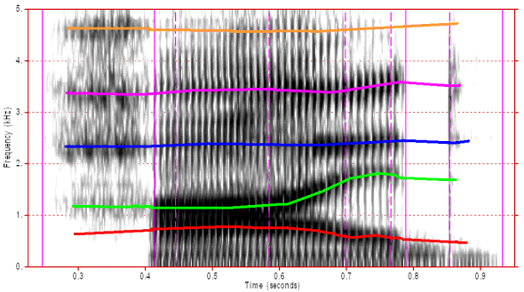

# **Phonetic and Phonological Analysis**

Wednesdays, 2:30-5:30pm\
[Calumet College](https://www.yorku.ca/colleges/calumet/), Rm. 318\
Instructor: [Chandan Narayan](https://ch-narayan.github.io)\
Contact: [chandann@yorku.ca](mailto:chandann@yorku.ca)\
[Course outline and schedule](LAL6120syllabus.html)

### About

This course provides a graduate-level introduction to phonetics and phonology. The course covers some basics of speech acoustics and then engages with primary research in detail addressing few phonological features and their acoustic manifestation. We also discuss the role of speech production, acoustics, and perception in the shaping of phonological systems of the world's languages. Students will learn about experimental research in phonetics and phonology as well as the implementation of a phonological research program.

### How to use this site

This site is meant to serve as the primary resource for our discussions. On occasion we will also use [eClass](https://eclass.yorku.ca) for discussion boards. 

</a>

