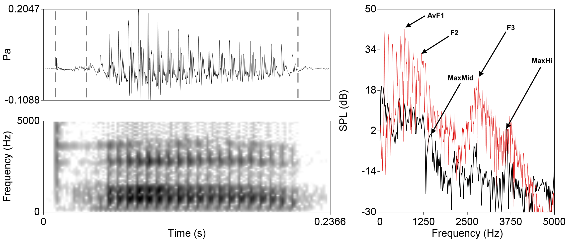

# **Phonetic and Phonological Analysis**

Wednesdays, 2:30-5:30pm\
[Calumet College](https://www.yorku.ca/colleges/calumet/), Rm. 318\
Instructor: [Chandan Narayan](https://ch-narayan.github.io)\
Contact: [chandann@yorku.ca](mailto:chandann@yorku.ca)\
[Course outline and schedule](LAL6120syllabus.html)

### About

XXX

### How to use this site

This site is meant to serve as a supplement to the delivered lectures and associated slides posted on [eClass](https://eclass.yorku.ca). The notes will give a bit more detail than the slides, as well as some practice problems of the type you might encounter on quizzes and exams. 

</a>

