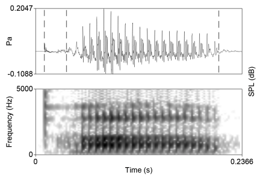
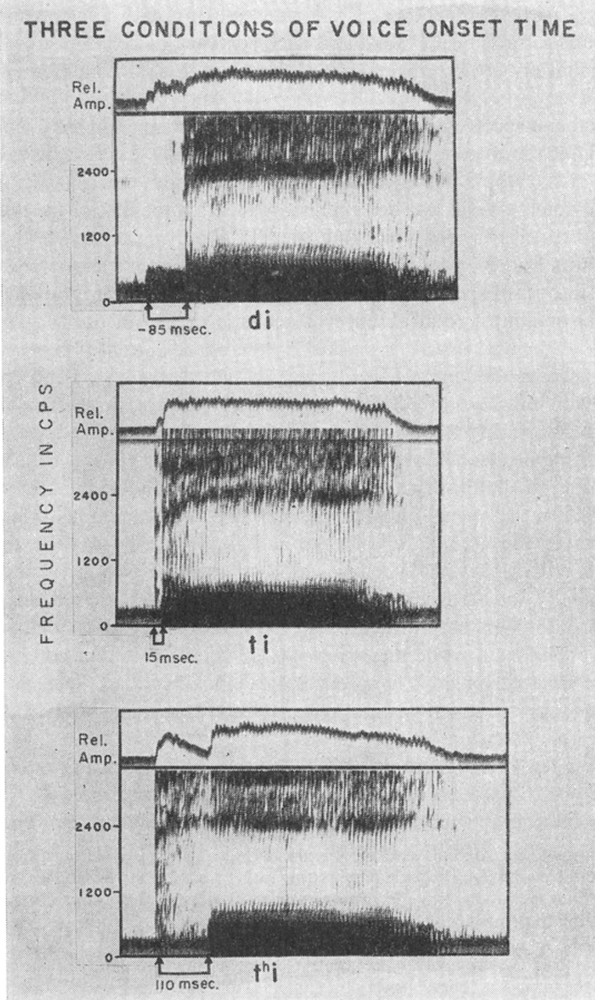
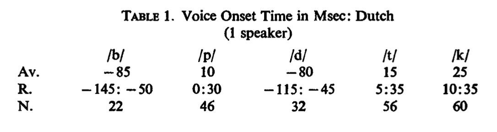
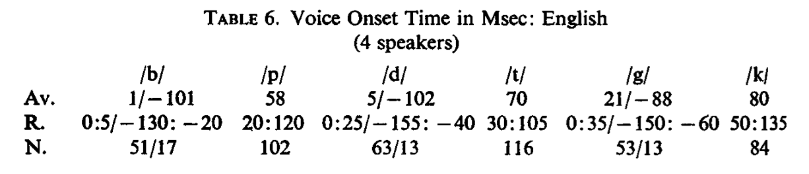
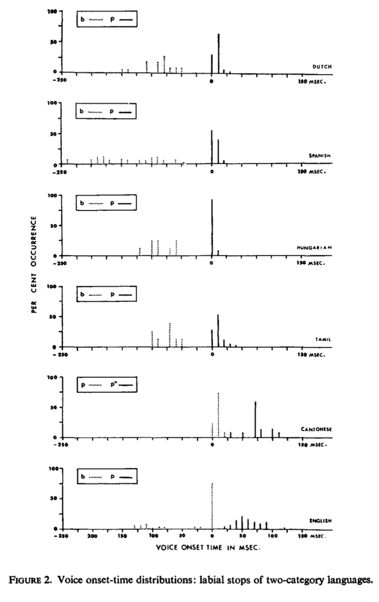

```{r setup, include=FALSE}
knitr::opts_chunk$set(echo = TRUE)
```

## VOT basics

* The primary acoustic characteristic corresponding to phonological voicing in oral stops is voice-onset time or *VOT*
* VOT is the time elapsed between the release of the oral closure and the onset of the periodic oscillation of the vocal folds
* Languages exploit this timing (a)synchronization to signal [voice] distinction

From Lisker and Abramson (1964):
"for voiced stops the formantless segment corresponding to the closure interval is traversed by a small number of low-frequency harmonic components, while in the case of voiceless stops the closure interval is essentially blank"

<p align="center">
  
</p>

* The above image shows an utterance of [$p^h$ a]. In the waveform representation, the area between the two dashed lines on the left is the VOT. There is some *art* required in the measurement of VOT and not all researchers will have the same landmarks for the beginning of the consonant release and the onset of vocal fold oscillation. As long as the research defines her criteria and remains consistent in measurement, then it's not an issue.

* In the image above, the vocal fold oscillation is taken at the "zero-crossing" of the first period of the voicing. What constitutes a period?

* The onset of the VOT is taken as the onset of transient noise which is consistent with the stop burst release. 

## Lisker and Abramson (1964)
Lisker and Abramson say that "articulatory force" is another phonetic factor separating the voicing categories, though what does it mean? They say it is "proprioceptive"&rarr; the speaker has a sense that it is more effortful or stronger. This *roughly* corresponds to the fortis/lenis distinction and perhaps the effects of voicing and aspiration are redundant sources of information.

But Fant says that fortis/lenis may not be necessary as all of the phonetic features (voicing during closure, aspiration, articulatory effort) are essentially related to the activity of the glottis at different point in time of stop production. 

Much of the introduction to the paper is wrestling with the utility of various phonetic features as indicative of the phonological distinctions observed in languages. 

Interesting phenomenon --> **covariation** between voicing and aspiration, which means where one is present, the other is absent. They note that this is the situation in English. But what about other langauges? 

**The purpose of the paper is to elucidate how clearly or neatly VOT corresponds to voicing in many languages.** They acknowledge that it's perhaps more complicated than initially seems, as languages like Hindi and Marathi, with voiced/voiceless aspirate series may not be separated solely by VOT. 

<p align="center">
  
</p>

## Categories of VOT according to LA

* Two-category: AmEn, Cantonese, Dutch, Hungarian, (Carib) Spanish, Tamil
* Three-category: Korean, Armenian, Thai
* Four-category: Hindi, Marathi (both Indic languages)

For the most part, two-category seems relatively uninteresting...except when we look at where the VOT is dimension is divided. Let's look at AmEn vs. Dutch (two closely related languages)

<p align="center">
  
</p>

Now let's examine the labial place across languages:

<p align="center">
  
</p>

## Praat VOT measuring

For each of these sound files, measure the VOT and put it in a spreadsheet. Find the mean for each place of articulation. Can you make some generalizations?

pa-ta (ret) -ka from Hindi


pa-ta (dental)-ka from Mandarin


